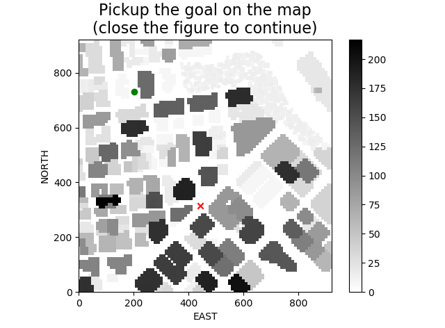
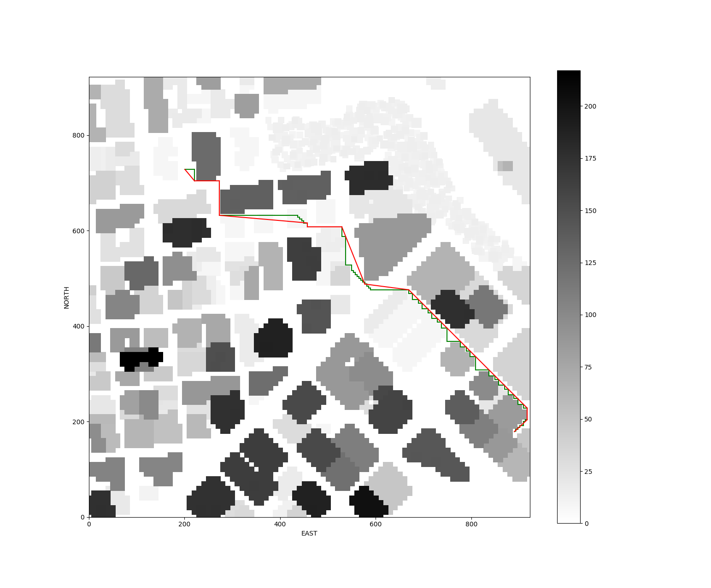

## Project: 3D Motion Planning

---
### Writeup / README

#### 1. Provide a Writeup / README that includes all the rubric points and how you addressed each one. You can submit your writeup as markdown or pdf.

You're reading it! Below I describe how I addressed each rubric point and where in my code each point is handled.

### Explain the Starter Code

#### 1. Test that `motion_planning.py` is a modified version of `backyard_flyer_solution.py` for simple path planning. Verify that both scripts work. Then, compare them side by side and describe in words how each of the modifications implemented in `motion_planning.py` is functioning.

While in `backyard_flyer_solution.py` the script calculate waypoints of a square box and send them to the simulator, the startup code in `motion_planning.py` make different action. It first read in colliders information from `colliders.cvs` and build a 2D map based on it. It then assumed the drone is laid in the origin of local NED frame. It then set a goal of 10 meters northward and 10 meters eastwards. After setting the goal, a simple 2D A* searching, which contains only 4 actions (EAST, SOUTH, WEST and NORTH), is performed to find a path from the start location to the goal and finally the waypoints of the path is then sent to the simulator, commanding the drone to fly from start to goal.

### Implementing Your Path Planning Algorithm

#### 1. In the starter code, we assume that the home position is where the drone first initializes, but in reality you need to be able to start planning from anywhere. Modify your code to read the global home location from the first line of the `colliders.csv` file and set that position as global home (`self.set_home_position()`)

In `motion_planning.py`, L162 - L67 in `MotionPlanning.plan_path()` function, you can see the code reading home location from `colliders.csv`. The first line in `colliders.csv` contains the home location information. The line is written in a pattern `lon0 <some value>, lat0 <some value>` so following this pattern, I can easily read in the home information data.

Later I called `Drone.set_home_position()`, L170 in `motion_planning.py`, to set the location read as the global home. 

#### 2. In the starter code, we assume the drone takes off from map center, but you'll need to be able to takeoff from anywhere. Retrieve your current position in geodetic coordinates from self._latitude, self._longitude and self._altitude. Then use the utility function global_to_local() to convert to local position (using self.global_home as well, which you just set)

As long as I can access to the drone's global position, I can use the utility function `global_to_local()` to convert the drone's global position to local position in NED frame. In `motion_planning.py`, L172 - L174, you can see my codes for the conversion task.

#### 3. In the starter code, the start point for planning is hardcoded as map center. Change this to be your current local position.

I've written 2 utility function, `MotionPlanning.grid_coord_to_local_position` for converting coordinate in grid into local position NED frame and `MotionPlanning.local_position_to_grid_coord` to do the inverse. See L145 - L154 in `motion_planning.py`

In L189 - L191 of `motion_planning.py`, you can see I used the utility function to convert local position into a A* search-ready location. The altitude for the start is a little bit tricky. When the drone is set off on the ground, it's altitude is specified by `TARGET_ALTITUDE`, which is 5. But if the drone is taking off from the roof of building, it's altitude is generally greater than `TARGET_ALTITUDE`, thus the altitude for the starting point is set to the maximum value of `TARGET_ALTITUDE`, current altitude + 1 and the altitude for the corresponding location in the map + 1. + 1 is required for the A* search algorithm I've written. 

#### 4. In the starter code, the goal position is hardcoded as some location 10 m north and 10 m east of map center. Modify this to be set as some arbitrary position on the grid given any geodetic coordinates (latitude, longitude)

For the goal location things go similar. See L203 - L208 of `motion_planning.py`.

To make thing more easy and funny(I do think so), I've added an interactively goal pick up process. After the map is constructed, it will be shown as a matplotlib figure. In this figure, the current location of the drone is marked as a red cross. As you click on the figure, a green dot is shown indicating the goal you picked. By closing the figure you will confirm the goal location and the script will continue.

 

#### 5. Write your search algorithm. Minimum requirement here is to add diagonal motions to the A* implementation provided, and assign them a cost of sqrt(2). However, you're encouraged to get creative and try other methods from the lessons and beyond!

I do not used the A* search algorithm from `planning_utils.py`. All the relevant codes are in `project_utils.py`.

I used the 2.5D A* searching approach for the planning problem. Codes for creating the 2.5D map can be found in L44 - L80 in `project_utils.py`, the `create_grid_2_5d` function. The way the 2.5D map is constructed is similar to the original 2D except in my 2.5D map, each cell contains the minimum required altitude to fly.

The corresponding 2.5D A* implementation can be found in L208 - L273 in `project_utils.py`, the `a_star_2_5d` function. I did not augmented with diagonal motions but changed the step size each time the next cell is looked for. See L25 - L28 in `project_utils.py`. I've set the step size to be 4.

With this "big" step size, I will have to tackle some problem:

1. the planner may not find a path exactly to the goal we chose since the next cell can "overshoot" the target goal. The handle with this, I made the searching stop once it has reached a cell ±2 cells from the goal.

2. because the grid is built in 1m resolution, with a 4m step size, the planner may give out a path that is valid only if there're no obstacles with greater altitude between the endpoints. This is indeed a problem if I includes the diagonal actions, but since the planner only use 4 non-diagonal directions and the safety distance around obstacles is set to 5, I can safely ignore it.

Why? Because if the safety distance is set to 5, that means for any obstacles in the map it at least spans 10 meters, which is less than the 4 meters step size I used.

3. can the planner result in no feasible plan can be found? No, because in 2.5D planner, we can "fly over" any obstacle. Unlike 2D planner, every cells in 2.5D planner are valid.

By ignoring diagonal motions and with a "big" step size, I got a 2.5D A* planner with acceptable searching speed.

To avoid the planner preferring path with high altitude, I've added another altitude cost term in the action cost. See L120 in `project_utils.py`. 

#### 6. Cull waypoints from the path you determine using search.

One drawback is, without diagonal motions, the planner will give out zigzag path. The make to path more neat, I first apply collinearity check on the path to remove unnecessary immediate waypoints. See `prune_path` in L176 - L197 and `points_collinear_3d` in L168 - L173 in `project_utils.py`.

The pruned path is further culled by performing ray tracing analysis using Bresenham. See `simplify_path` in L312 - L347 and `bresenham` in L350 - L388 in `project_utils.py`.

Here's a comparison before and after path culling:

 
### Executing the flight
#### 1. This is simply a check on whether it all worked. Send the waypoints and the autopilot should fly you from start to goal!

It works! Try it!